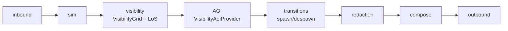

# Fog of War Transport Architecture (MVP14)

## End-to-end pipeline

## Contract (non-negotiable)

- The server **must never send invisible entities**, including **never leaking invisible `EntityId` values**.
- Contract scope includes full snapshot arrays and delta arrays (`Entities`, `Enters`, `Updates`, `Leaves`).
- Ordering must remain canonical (`EntityId` ascending) to preserve deterministic replay behavior.

## Stage notes

1. **VisibilityGrid / LoS**
   - Computes visibility sets from authoritative world state.
   - Faction-scoped and deterministic from tick state.

2. **AOI provider (PR-81)**
   - `VisibilityAoiProvider` uses visibility set as AOI source.
   - Prevents radius-only AOI from exposing non-visible entities.

3. **Transitions (PR-83)**
   - Visibility enter => spawn transition (`Enters`).
   - Visibility exit => despawn transition (`Leaves`).
   - Tick-stable transition detection; no duplicate enter/leave churn.

4. **Redaction (PR-82)**
   - Final payload filter before compose/outbound.
   - Removes any invisible entity from full and delta payload paths.

5. **Compose / outbound**
   - Snapshot payload is serialized only after transitions + redaction.
   - Outbound stream must preserve canonical ordering and no-leak contract.

6. **Canary + Replay guardrails (PR-84/85/86/87)**
   - Canary validates scenario-level no-leak and deterministic transitions.
   - Performance guardrails protect visibility/AOI cost envelope.
   - Invariant hardening enforces no-leak/order/spawn-before-state rules.
   - Replay fixture `FogTransitionScenario` provides stable regression evidence.

## Test categories introduced and used in MVP14 closure

- PR-81: visibility-based AOI provider
- PR-82: redaction and payload isolation
- PR-83: spawn/despawn transition determinism
- PR-84: fog canary and restart determinism
- PR-85: performance guardrails
- PR-86: stream invariant hardening
- Canary: end-to-end smoke/gating lane
- ReplayVerify: deterministic replay lane
